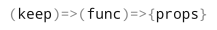
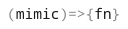
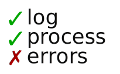

This repository contains the logos used in my projects.

The names and logos are trademarked, but you are free to use them providing they
follow the [trademark guidelines](TRADEMARK_GUIDELINES.md).

The `validate-path` logo is licensed under
[CC BY 4.0](https://creativecommons.org/licenses/by/4.0/). It was designed by
[reallinfo](https://github.com/reallinfo).

# Logos

# Fonts

  - [Tenby Five](http://www.paragraph.com.au/tenby.html): autoserver.
  - [DejaVu Sans](https://en.wikipedia.org/wiki/DejaVu_fonts): log-process-errors, cross-platform-node.
  - [Droid Sans Mono](https://en.wikipedia.org/wiki/Droid_fonts): keep-func-props, unix-permissions.
  - [ISL Fade To Blak](https://www.dafont.com/isl-fade-to-blak.font): execa, gulp-execa.
  - [Montserrat](https://fonts.google.com/specimen/Montserrat): validate-path.
