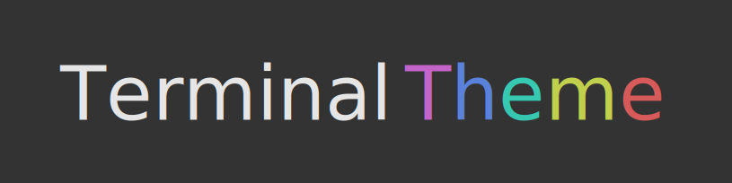

This repository contains the logos used in my projects.

The names and logos are trademarked, but you are free to use them providing they
follow the [trademark guidelines](TRADEMARK_GUIDELINES.md).

The `validate-path` logo is licensed under
[CC BY 4.0](https://creativecommons.org/licenses/by/4.0/). It was designed by
[reallinfo](https://github.com/reallinfo).

# Logos

 

<picture>
  <source media="(prefers-color-scheme: dark)" srcset="cross-platform/cross-platform_dark.svg"/>
  
</picture>
 

<picture>
  <source media="(prefers-color-scheme: dark)" srcset="cross-platform-nodejs/cross-platform-nodejs_dark.svg"/>
  
</picture>
 

 

<picture>
  <source media="(prefers-color-scheme: dark)" srcset="execa/execa_dark.svg"/>
  
</picture>
 

<picture>
  <source media="(prefers-color-scheme: dark)" srcset="gulp-execa/gulp-execa_dark.svg"/>
  
</picture>
 

<picture>
  <source media="(prefers-color-scheme: dark)" srcset="get-bin-path/get-bin-path_dark.svg"/>
  
</picture>
 

<picture>
  <source media="(prefers-color-scheme: dark)" srcset="keep-func-props/keep-func-props_dark.svg"/>
  
</picture>
 

<picture>
  <source media="(prefers-color-scheme: dark)" srcset="log-process-errors/log-process-errors_dark.svg"/>
  
</picture>
 

<picture>
  <source media="(prefers-color-scheme: dark)" srcset="mimic-fn/mimic-fn_dark.svg"/>
  
</picture>
 

<picture>
  <source media="(prefers-color-scheme: dark)" srcset="modern-errors/modern-errors_dark.svg"/>
  
</picture>
 

<picture>
  <source media="(prefers-color-scheme: dark)" srcset="nve/nve_dark.svg"/>
  
</picture>
 

<picture>
  <source media="(prefers-color-scheme: dark)" srcset="spyd/spyd_dark.svg"/>
  
</picture>
 

<picture>
  <source media="(prefers-color-scheme: dark)" srcset="terminal-theme/terminal-theme_dark.svg"/>
  
</picture>
 

<picture>
  <source media="(prefers-color-scheme: dark)" srcset="test-each/test-each_dark.svg"/>
  
</picture>
 

<picture>
  <source media="(prefers-color-scheme: dark)" srcset="unix-permissions/unix-permissions_dark.svg"/>
  
</picture>
 

<picture>
  <source media="(prefers-color-scheme: dark)" srcset="validate-path/validate-path_dark.svg"/>
  
</picture>
 

 

 

# Fonts

- [Atmos](https://www.behance.net/dmzl-studio): modern-errors
- [Break](https://www.creativefabrica.com/product/break-7/ref/144265): declarative-merge
- [DejaVu Sans](https://en.wikipedia.org/wiki/DejaVu_fonts): log-process-errors, cross-platform-node
- [Droid Sans Mono](https://en.wikipedia.org/wiki/Droid_fonts): get-bin-path, keep-func-props, mimic-fn, unix-permissions
- [ISL Fade To Blak](https://www.dafont.com/isl-fade-to-blak.font): execa, gulp-execa
- [Montserrat](https://fonts.google.com/specimen/Montserrat): validate-path
- [Neuropolitical](http://typodermicfonts.com/neuropolitical-science): test-each
- [Perfect Dark](https://www.dafont.com/perfect-dark.font): nve
- [Segment7](https://fontlibrary.org/en/font/segment7): spyd
- [Tenby Five](http://www.paragraph.com.au/tenby.html): autoserver
- [Vanilla Whale](https://typodermicfonts.com/vanilla-whale): wild-wild-parser, wild-wild-path, wild-wild-utils
