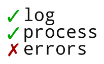

This repository contains the logos used in my projects.

The names and logos are trademarked, but you are free to use them providing they
follow the [trademark guidelines](TRADEMARK_GUIDELINES.md).

# Logos

- The logo of the validate-path is designed by [reallinfo](https://github.com/reallinfo).

- The logo is licensed under a [Creative Commons Attribution 4.0 International License](https://creativecommons.org/licenses/by/4.0/). 

# Fonts

  - [Tenby Five](http://www.paragraph.com.au/tenby.html): autoserver.
  - [DejaVu Sans](https://en.wikipedia.org/wiki/DejaVu_fonts): log-process-errors, cross-platform-node.
  - [Droid Sans Mono](https://en.wikipedia.org/wiki/Droid_fonts): unix-permissions.
  - [ISL Fade To Blak](https://www.dafont.com/isl-fade-to-blak.font): execa.
  - [Montserrat](https://fonts.google.com/specimen/Montserrat): validate-path.
